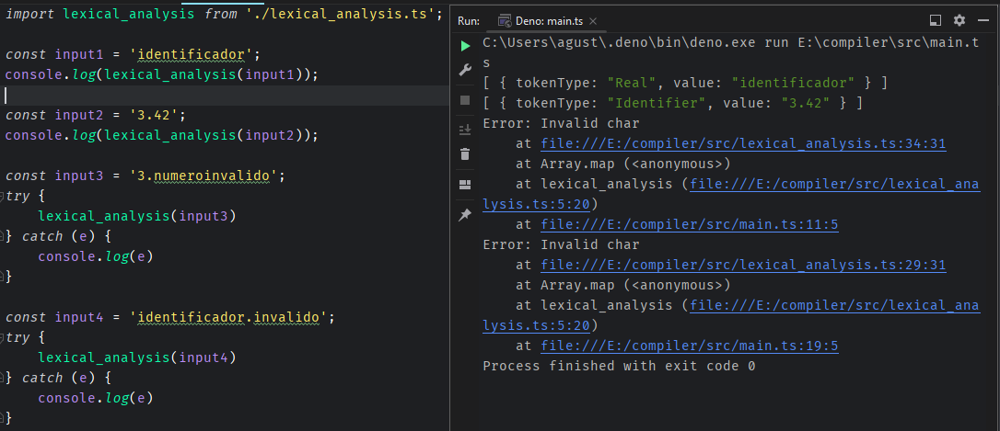

# Mini Analizador Lexico

Genera un pequeño analizador léxico, que identifique los siguientes tokens (identificadores y números reales) construidos de la siguiente manera.

identificadores = letra(letra|digito)*
Real = entero.entero+ 

